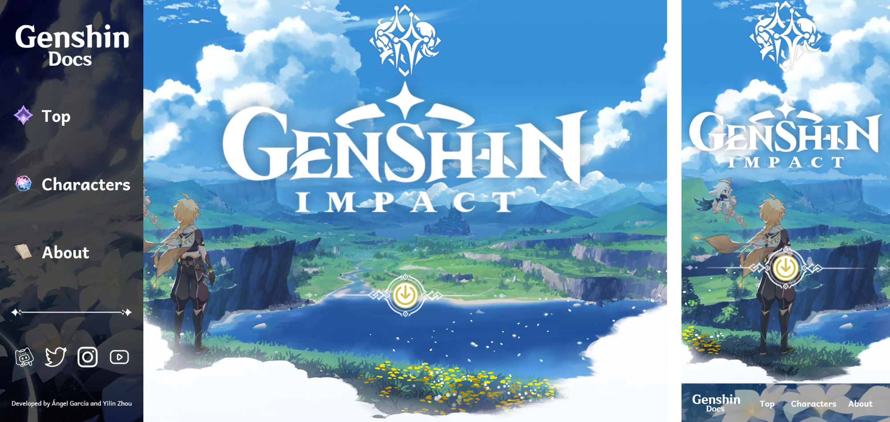

# Genshin Docs
Genshin docs is a fan-page for the game Genshin Impact. It is a website that provides information about the characters from the game. 

## Preview

Visualize in [Website](https://nilyz.github.io/genshin-doc/)

## About
Genshin Docs is a Single Page Application (SPA) that uses the [Genshin Impact API](https://genshin.dev/) to get the information about the characters. 

## Features to highlight
- The website is responsive and can be used in any device.
- The website will display the characters in a attractive and adaptive way.
- The website has a search bar that allows the user to search for a specific character.
- The website has a filter that allows the user to filter the characters by their element or nation.

## Technologies
Genshin Docs is created with:
- `HTML`
- `CSS`, with BEM methodology
- `JavaScript` Vanilla

 

---
#### Developed by [Yilin Zhou](https://github.com/Nilyz/), [Ángel García](https://github.com/Paman00)
